# 智能电商客服 RAG 系统

> 基于检索增强生成（RAG）的全栈智能电商客服系统，支持商品咨询、订单/物流问答、购物车、收藏、数据分析与多模态交互（语音、图片、翻译）。

[](https://www.python.org/)
[](https://fastapi.tiangolo.com/)
[](https://react.dev/)
[](https://vitejs.dev/)

---

## 项目截图

> 以下截图为在本地运行真实前后端后捕获的实际界面。

### 1. 智能对话首页

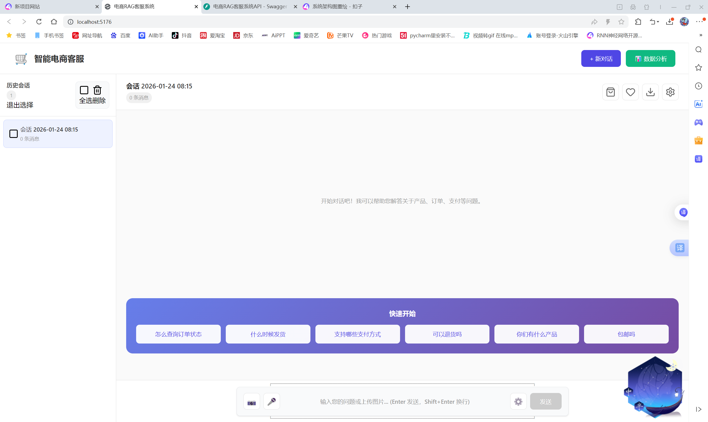

### 2. 商品推荐结果

输入需求后，系统基于 RAG 检索并返回推荐商品卡片。

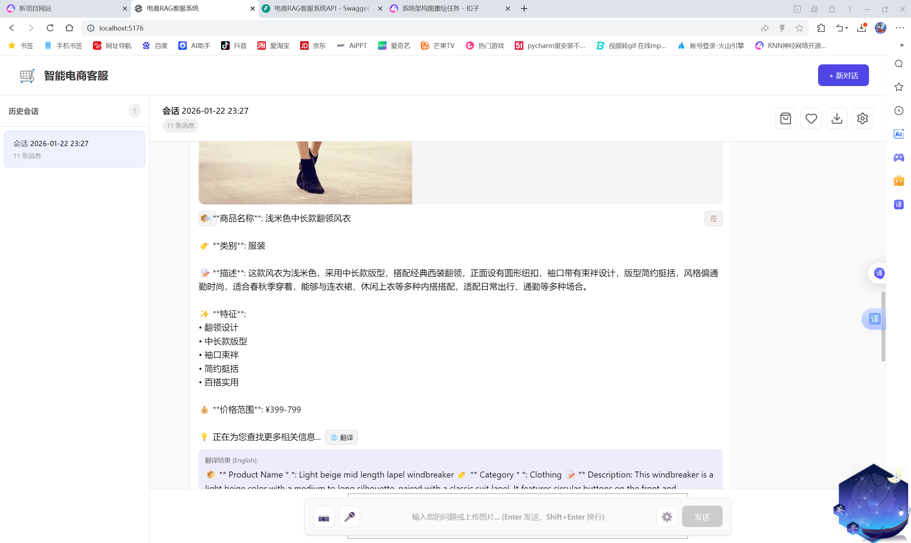

### 3. 商品推荐大图展示

商品卡片在对话中展开大图，展示真实商品图片与完整描述。

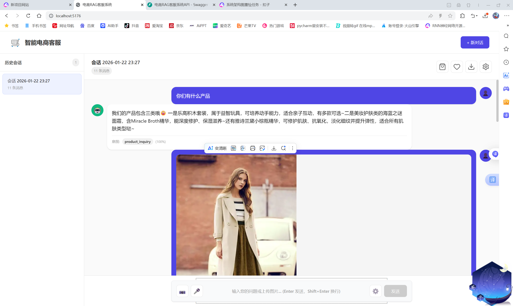

### 4. 商品卡片操作

支持一键加入购物车与收藏。

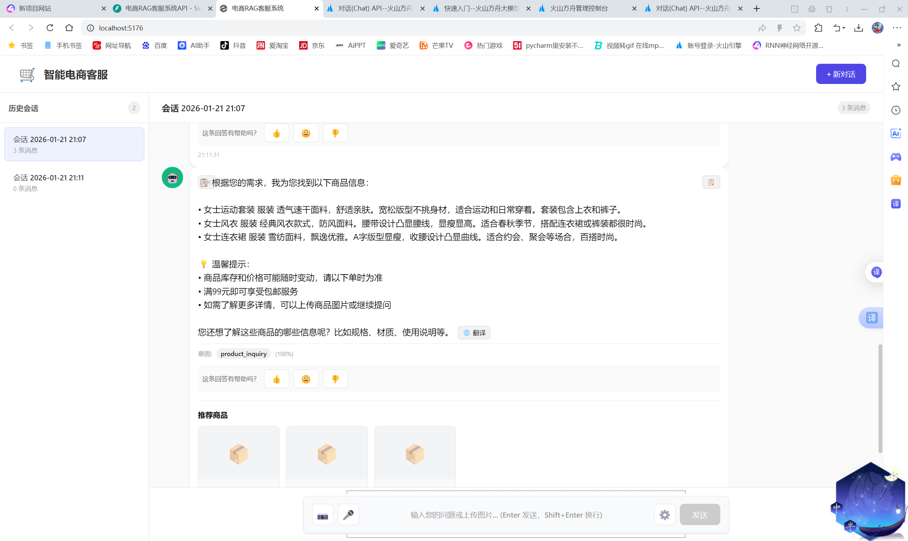

### 5. 购物车

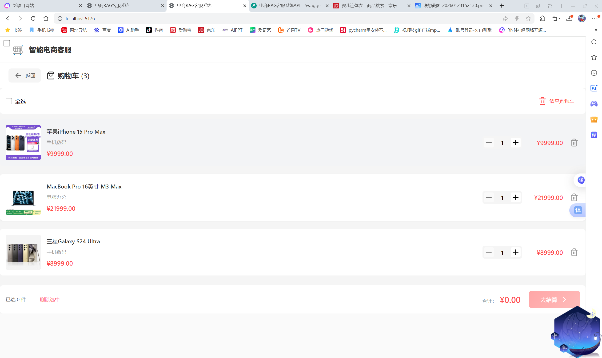

### 6. 收藏/心愿单

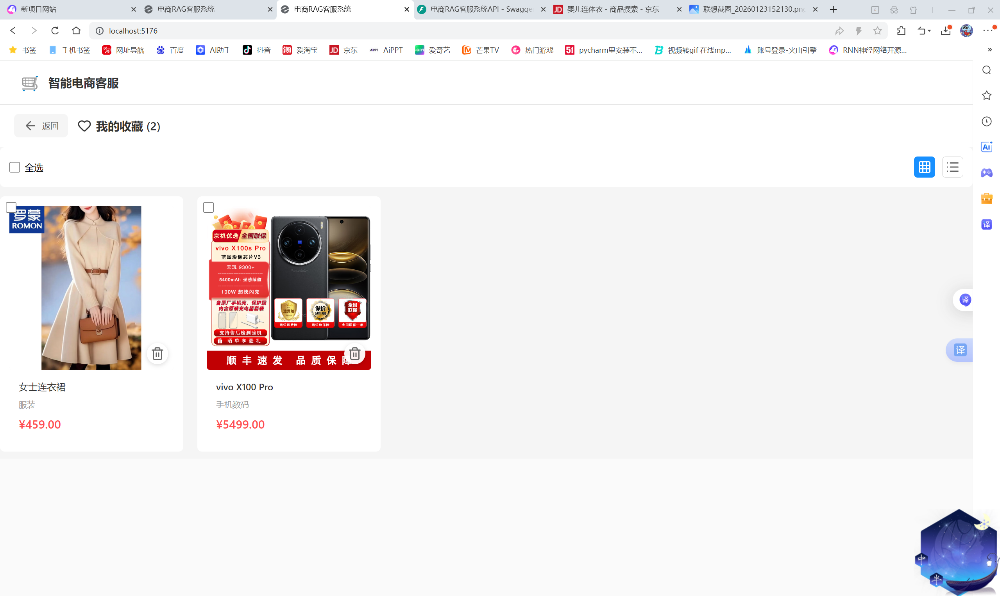

### 7. 数据分析概览

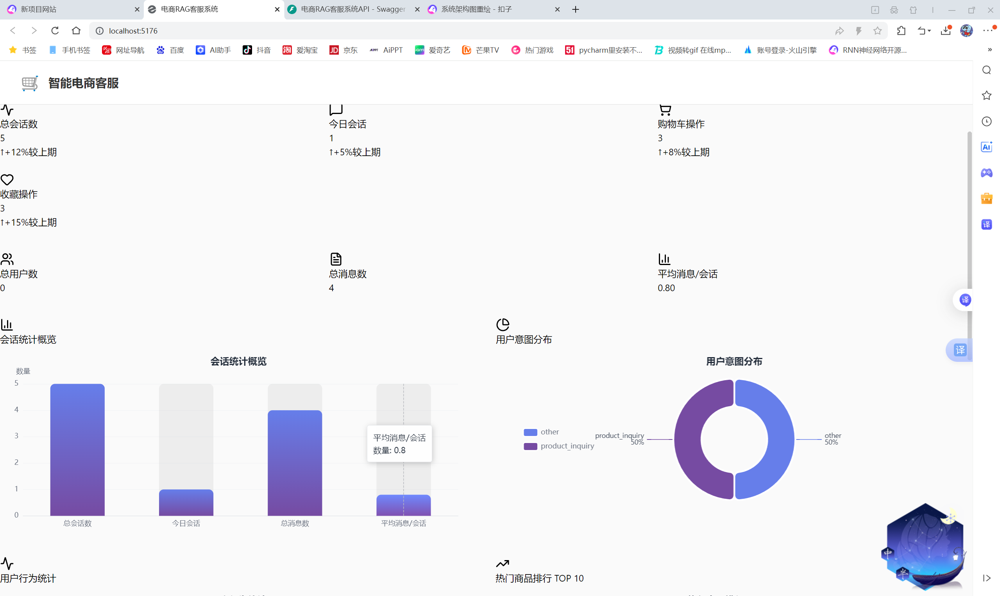

### 8. 数据分析图表详情

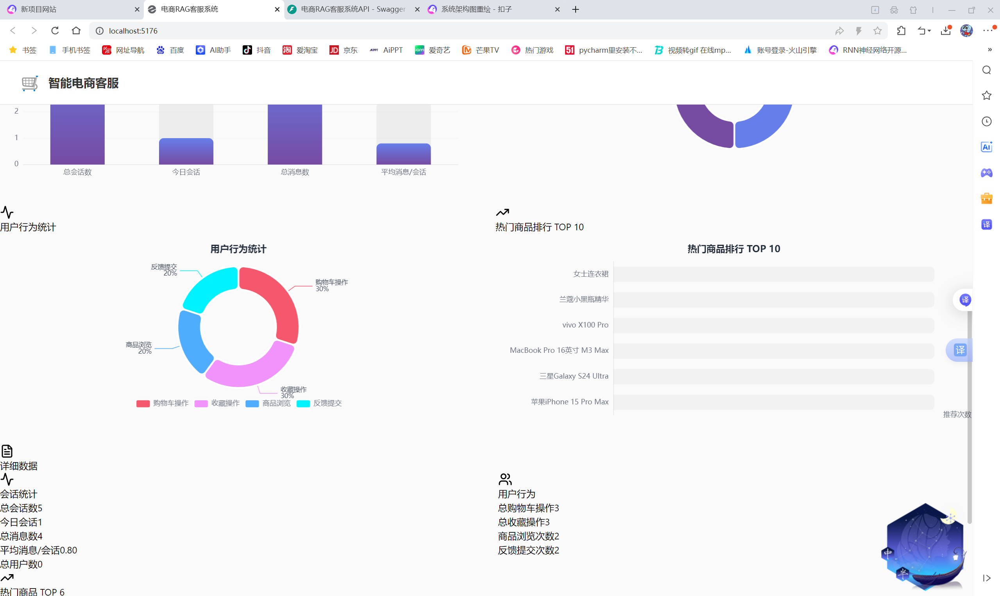

### 9. 热门商品排行

展示用户行为统计与热门商品 TOP 排行。

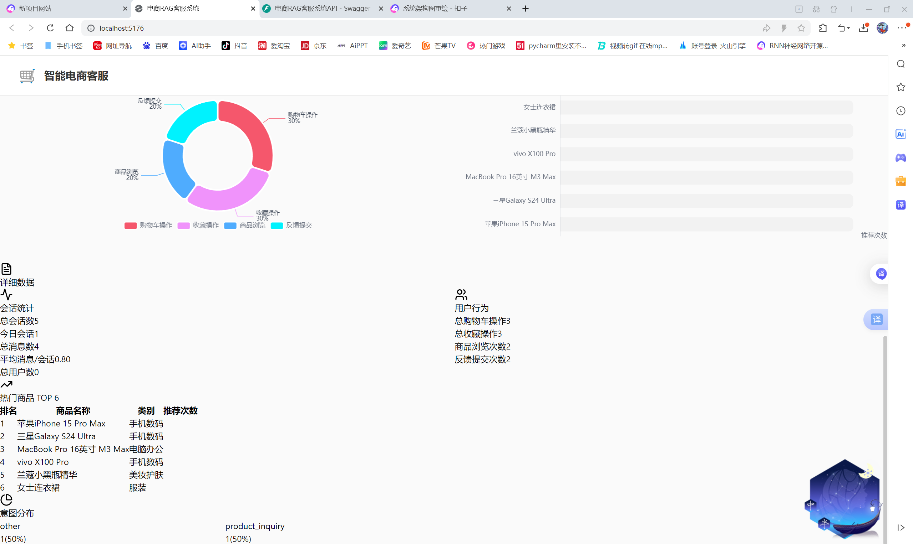

### 10. 导出对话历史

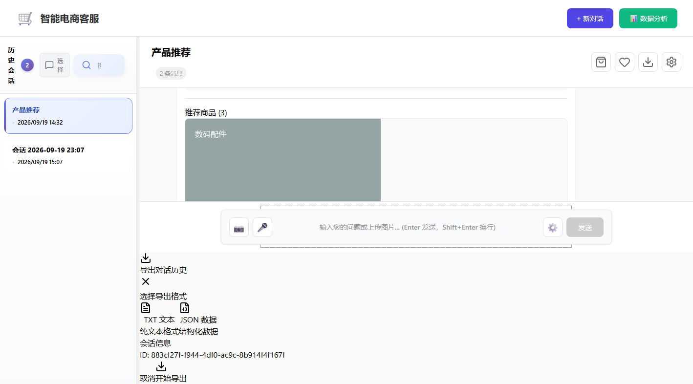

### 11. 设置（主题 / 语言 / TTS）

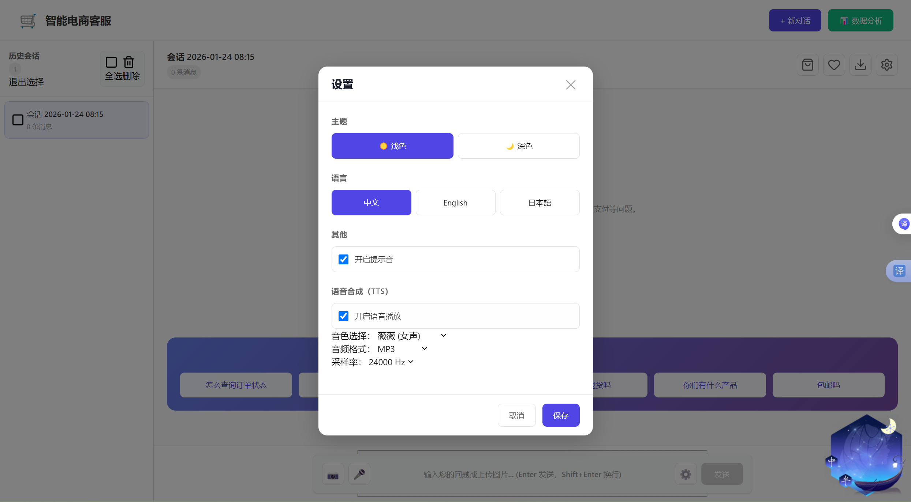

### 12. 用户反馈

对助手回复点赞 / 点踩 / 一般反馈。

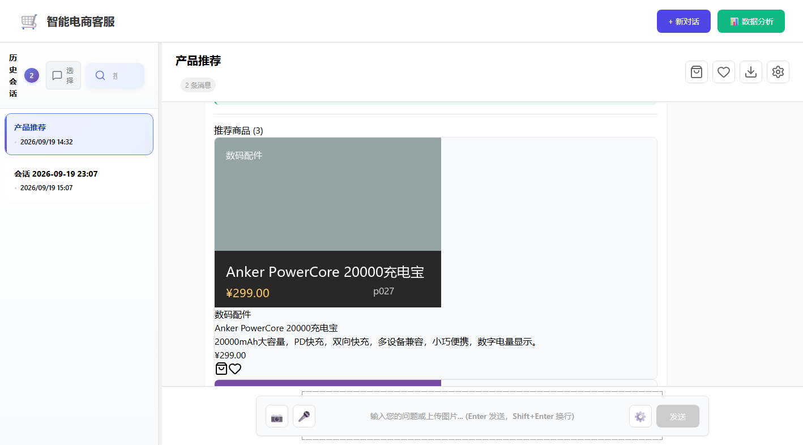

### 13. API 文档（Swagger）

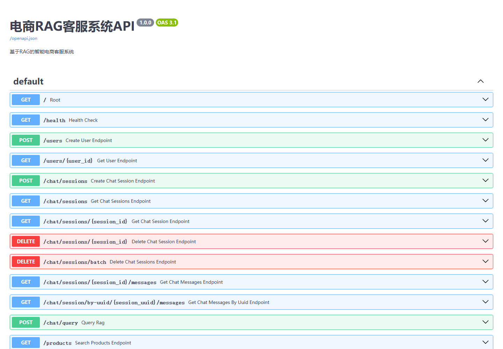

---

## 功能特性

| 模块 | 功能 | 状态 |
|------|------|------|
| 智能问答 | 基于 FAISS 向量检索 + 意图分类 + 重排序的商品/FAQ 问答 | 已完成 |
| 多轮会话 | 支持会话列表、新建会话、历史消息加载、批量删除 | 已完成 |
| 商品推荐 | 在回复中附带相关商品卡片，支持点击加入购物车 | 已完成 |
| 购物车 | 商品增删改、全选、结算提示 | 已完成 |
| 收藏 | 心愿单添加/移除 | 已完成 |
| 数据分析 | echarts 会话统计、意图分布、用户行为、热门商品排行 | 已完成 |
| 多模态 | 语音输入（Web Speech API）、文字转语音、图片上传识别、中英翻译 | 已完成（需配置外部服务） |
| 反馈 | 对助手回复点赞/点踩 | 已完成 |
| 导出 | 对话历史导出 TXT、数据分析报告导出 JSON | 已完成 |

---

## 技术栈

### 后端

- **FastAPI** + **Python 3.10+**
- **FAISS** 向量检索（默认；可选 ChromaDB）
- **Sentence-Transformers** 文本嵌入（`paraphrase-multilingual-MiniLM-L12-v2`）
- **SQLite** 持久化（会话、消息、购物车、收藏、反馈）
- **OpenAI 兼容 API / 豆包（Doubao）API** 大模型生成，失败时自动回退模板兜底
- **自定义 RAG 流程**：意图分类 → Embedding 检索 → Rerank → LLM 生成 → 商品卡片推荐

### 前端

- **React 18** + **Vite 5**
- **Tailwind CSS** + 自定义 CSS
- **echarts** 数据可视化
- **lucide-react** 图标
- 原生 **Fetch API**（无 Axios）

---

## 项目结构

```
rag-ecommerce-chatbot/
├── backend/
│   ├── app/
│   │   ├── ai_models/          # 嵌入模型、意图分类、重排序、响应生成
│   │   ├── api/                # API 路由
│   │   ├── crud/               # 数据库 CRUD
│   │   ├── database.py         # SQLite 初始化与连接
│   │   ├── knowledge_base/     # FAQ、products.json 知识库
│   │   ├── rag_engine.py       # RAG 引擎主流程
│   │   ├── vector_store.py     # FAISS / ChromaDB 向量存储实现
│   │   └── main.py             # FastAPI 入口
│   ├── requirements.txt
│   └── start.py                # 后端启动脚本
├── frontend/
│   ├── public/assets/          # 商品图片（运行脚本生成，默认不提交 Git）
│   ├── src/
│   │   ├── components/         # 聊天、商品卡片、弹窗等组件
│   │   ├── pages/              # 购物车、收藏、数据分析页面
│   │   ├── api/api.js          # 前端请求封装
│   │   └── App.jsx             # 应用主组件
│   └── package.json
├── docs/screenshots/           # 项目真实截图
├── scripts/
│   └── generate_demo_images.py # 生成演示商品图片
├── FEATURES.md                 # 功能清单与实现进度
├── QUICK_START.md              # 旧版快速启动（仅供参考）
└── README.md                   # 本文件
```

---

## 快速开始

### 环境要求

- Python 3.10+
- Node.js 18+
-（可选）OpenAI / 豆包 API Key，用于大模型生成；不配置时自动使用模板兜底

### 1. 克隆仓库

```bash
git clone https://github.com/kll237/rag-ecommerce-chatbot.git
cd rag-ecommerce-chatbot
```

### 2. 启动后端

```bash
cd backend
python -m venv venv

# Windows
venv\Scripts\activate

# macOS/Linux
source venv/bin/activate

pip install -r requirements.txt
python start.py
```

后端默认运行在 http://localhost:8000，API 文档地址 http://localhost:8000/docs。

### 3. 启动前端

在另一个终端中：

```bash
cd frontend
npm install
npm run dev
```

前端默认运行在 http://localhost:5173。

### 4. 生成演示商品图片

由于原始演示图片体积较大（约 135 MB），仓库未提交商品图片。首次运行后执行：

```bash
# 在项目根目录
python scripts/generate_demo_images.py
```

脚本会基于 `backend/app/knowledge_base/products.json` 在 `frontend/public/assets/` 生成轻量占位图，使商品卡片正常显示。

---

## 配置说明

复制 `backend/.env.example` 为 `backend/.env`，按需填写：

```env
# 大模型（OpenAI 兼容）
OPENAI_API_KEY=sk-xxx
OPENAI_BASE_URL=https://api.openai.com/v1
OPENAI_MODEL=gpt-3.5-turbo

# 或豆包大模型
DOUBAO_API_KEY=xxx
DOUBAO_BASE_URL=https://ark.cn-beijing.volces.com/api/v3
DOUBAO_MODEL=doubao-seed-1-6-vision-250815

# 百度翻译（图片 OCR 结果翻译）
BAIDU_TRANSLATE_APP_ID=xxx
BAIDU_TRANSLATE_SECRET_KEY=xxx
```

> **提示**：若未配置大模型 Key，系统会回退到内置模板生成回复，仍可体验完整前端交互与数据分析。

---

## 主要 API 接口

| 方法 | 路径 | 说明 |
|------|------|------|
| GET | `/health` | 健康检查 |
| POST | `/chat/query` | 发送消息并获取 RAG 回复 |
| GET | `/chat/sessions` | 获取会话列表 |
| POST | `/chat/sessions` | 创建会话 |
| GET | `/chat/sessions/{id}/messages` | 获取会话消息 |
| GET | `/products` | 商品列表 |
| GET | `/products/{id}` | 商品详情 |
| GET | `/cart` | 购物车 |
| POST | `/cart/items` | 加入购物车 |
| PUT | `/cart/items/{id}` | 更新数量 |
| DELETE | `/cart/items/{id}` | 删除商品 |
| GET | `/wishlist` | 收藏列表 |
| POST | `/feedback` | 提交反馈 |
| GET | `/analytics/overview` | 综合分析报告 |
| GET | `/analytics/export` | 导出分析报告 |

完整接口列表见后端自动生成的 Swagger 文档：http://localhost:8000/docs

---

## RAG 流程

```
用户输入
  │
  ▼
意图分类（关键词 + Embedding 相似度）
  │
  ▼
FAISS 向量检索 TOP-K 文档
  │
  ▼
Embedding 语义重排序
  │
  ▼
LLM 生成（OpenAI/Doubao API）→ 失败则回退模板兜底
  │
  ▼
返回文本答案 + 推荐商品卡片
```

---

## 已实现 vs 待完善

### 已实现

- FAISS 向量检索与持久化
- 基于规则 + 语义嵌入的意图分类
- 基于余弦相似度的重排序
- 大模型生成 + 模板兜底
- 多轮会话 CRUD（SQLite）
- 购物车、收藏、反馈、数据分析前端页面
- 语音输入/朗读、图片上传、翻译前端功能

### 待完善 / 已知限制

- **大模型需要外部 Key**：本地未内置 LLM，未配置 Key 时回复为模板化文本。
- **语音/图片识别依赖豆包 API**：未配置时相关功能会提示不可用。
- **商品图片未入仓**：原始图片约 135 MB，已改为通过脚本本地生成占位图。
- **数据分析为模拟/聚合展示**：当前 `analytics` 接口返回聚合指标，未接入实时流式埋点。
- **订单物流状态为静态 FAQ**：未对接真实 ERP/物流系统。
- **未实现暗黑模式、实时搜索建议、PDF 导出**（详见 `FEATURES.md`）。

---

## 运行测试

```bash
cd backend
pytest tests/ -v
```

> 注：当前测试覆盖以单元/集成测试为主，持续补充中。

---

## 贡献与许可

本项目为个人学习/简历作品，欢迎参考与交流。

如有问题，欢迎提交 Issue 或 PR。

---

## 作者

- GitHub: [@kll237](https://github.com/kll237)
